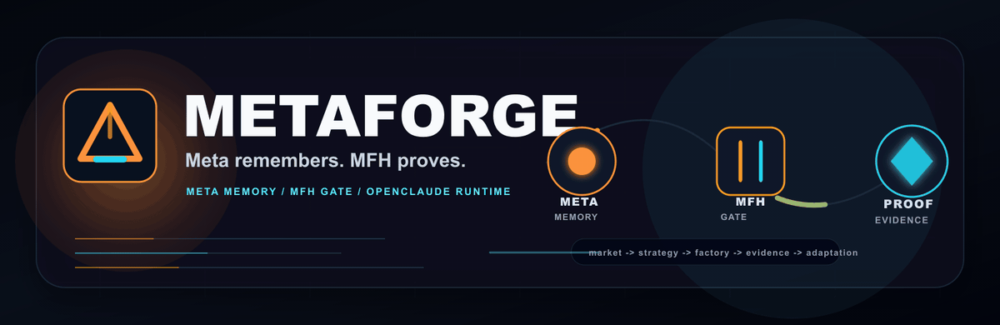

# Metaforge

[English](README.md) | [한국어](README.ko.md)

Metaforge는 Meta/MFH/Orchestra 기반의 governed-code 운영체제입니다.

OpenClaude는 현재 Metaforge가 올라타는 로컬 CLI 런타임입니다. 터미널 UX,
도구 호출, MCP, slash command, provider profile, streaming output, Claude/Codex
route를 제공합니다. 하지만 공개적으로 중심에 둘 가치는 OpenClaude 자체가
아니라 **Meta + MFH + Orchestra**입니다.

AVF Influence Factory는 기본 CLI runtime이 아니라 `avf/`와 `scripts/` 아래의
manual artifact lane입니다. Generated operator run output은 공개 checkout에
추적하지 않고 로컬 owner-review workspace에서만 재생성합니다.

Orchestra는 현재 이 package에서 runtime-wired layer입니다. Meta와 MFH는
governance, schema, evidence-gate surface입니다. AVF Influence Factory는
repo-local manual artifact lane입니다. 이 세 영역을 모두 기본 runtime module로
말하지 않습니다.

출처와 라이선스 경계: 이 repository에는 Anthropic Claude Code CLI에서 파생된
runtime code가 포함되어 있습니다. OpenClaude 기여자의 수정분은 법적으로 가능한 범위에서 MIT
라이선스로 제공되지만, 전체 파생 런타임에 대한 단순 MIT 라이선스가 아닙니다.
재사용이나 재배포 전에는 반드시 [LICENSE](LICENSE)를 확인하세요.

공개 히스토리 경계: Metaforge는 프라이빗/로컬 workbench에서 이 공개 checkout으로
옮겨온 surface라서 public commit/star 숫자가 낮은 것은 예상 가능한 맥락입니다.
이 이력은 채택, 외부 검증, production readiness 증거가 아닙니다. 공개 주장은
source-controlled test, report, claim-boundary record에서만 나와야 합니다.

## 한 줄 요약

Metaforge는 사용자의 의도를 장기 목표로 고정하고, Meta에 운영 기억을 남기며,
Orchestra로 작업을 분배하고, MFH evidence gate를 통과한 것만 완료 주장으로
승격하는 로컬 우선 agent OS입니다.

## 현재 증명 가능한 것

| 질문 | 현재 답 |
| --- | --- |
| 무엇인가요? | OpenClaude CLI runtime 위에서 동작하는 Meta/MFH/Orchestra OS입니다. |
| 바로 확인할 명령 | `bun run product:public-artifact-hygiene`, `bun run verify:privacy` |
| 가장 강한 공개 증거 | `docs/marketing/metaforge-public-proof-pack-2026-06-14.md`, `docs/MODEL_SYSTEM_CARD.md`, `docs/product-quality/product-evidence-manifest.md` |
| 증거 분류 | `docs/product-quality/product-evidence-manifest.md`의 evidence manifest는 behavioral runtime evidence와 static analysis, governance-boundary, source-control, structural-inventory evidence를 분리합니다. |
| 증명하지 않는 것 | production readiness, hosted deployment, external validation, benchmark superiority, autonomous reliability |

## 운영 레이어

| 레이어 | 역할 |
| --- | --- |
| Meta | 운영 기억, 결정, source ledger, 승인 경계 |
| Goal Kernel | 목표 계층, 성공 기준, non-goals, 검증 명령, rollback rule |
| Orchestra | Claude/Codex route, planning, critique, review, evidence arbitration |
| MFH | drift, state, evidence, closure, release claim을 막는 governed-code gate |
| OpenClaude runtime | tools, MCP, slash command, provider profile, streaming, credential route |

### 배선 증거 맵

| 심볼 | 공개 역할 | 증거 등급 | 런타임 경계 |
| --- | --- | --- | --- |
| Orchestra | Claude/Codex route 위에서 planner, skeptic, implementer, reviewer, evidence arbiter, promotion 역할을 분배합니다. | runtime-wired import path; unit/product-quality evidence | Runtime code는 `src/services/orchestra/`에 있고 CLI query surface에서 호출됩니다. |
| Meta/MFH | 운영 기억, goal contract, evidence gate, closure rule을 정직하게 유지합니다. | governance/docs/gates | `docs/`, schema, report, product-quality gate로 표현됩니다. 이 checkout의 별도 runtime module이 아닙니다. |
| Mimesis Engineering | OSS, 논문, 특허, 표준, 제품 패턴에서 load-bearing structure를 흡수하는 source-first loop입니다. | source-ledger loop이며 기본 runtime module이 아닙니다 | 공개 증거는 docs/source ledger와 local verification입니다. private/local workbench material은 public proof 밖에 둡니다. |
| AVF Influence Factory | venture/factory packet을 만드는 operator artifact flow입니다. | manual artifact lane이며 기본 CLI runtime import가 아닙니다 | `avf/`와 validator script에 있으며 generated operator output은 ignored local artifact로 남깁니다. |

## 빠른 시작

```bash
bun install
bun run build
node dist/cli.mjs
```

`npm install -g @gitlawb/openclaude` 명령은 external OpenClaude npm package를
설치하는 경로입니다. 즉 이 checkout에서 만든 배포물이 아니라는 의미에서
`not a Metaforge release artifact`입니다.

검증은:

```bash
bun run verify:privacy
```

## Claude / Codex route

Metaforge는 Claude와 Codex를 Orchestra 안의 실행 엔진으로 사용할 수 있습니다.
Claude route는 planner, skeptic, reviewer 역할에 쓸 수 있고, Codex route는
visible executor와 implementation role에 쓸 수 있습니다.

중요한 경계:

- Claude와 Codex는 engine입니다.
- 제품 중심은 Meta/MFH/Orchestra입니다.
- provider badge나 workflow badge는 외부 검증이 아니라 configured automation
  health와 local evidence link입니다.

## Mimesis Engineering

Mimesis Engineering은 이미 세상에 존재하는 강한 원본, 논문, 특허, 표준,
오픈소스 구현을 읽고 load-bearing structure를 추출한 뒤 로컬 시스템에
적용하고 검증하는 개선 엔진입니다.

이 방식은 “전문가인 척하는 프롬프트”가 아니라 “전문가의 산출물과 검증 구조를
가져와서 흡수하는 방식”입니다.

시작 문서:

- [docs/MIMESIS_ENGINEERING.md](docs/MIMESIS_ENGINEERING.md)
- [docs/research/mimesis-engineering-source-ledger-2026-06-14.md](docs/research/mimesis-engineering-source-ledger-2026-06-14.md)

## 검증

완료 주장은 파일 존재만으로 하지 않습니다. 관련 명령, test, loader check,
version probe, live inspection 중 하나 이상을 실제로 실행해야 합니다.

자주 쓰는 명령:

```bash
bun run build
bun run typecheck --pretty false
bun test
bun run verify:privacy
bun run product:quality
```

`product:quality`가 보호된 환경 경계에서 멈추면, 그것을 성공 주장으로 바꾸지
말고 생성된 report와 blocker를 그대로 읽어야 합니다.

## 공개 주장 경계

현재 이 repo가 말할 수 있는 것:

- Meta/MFH/Orchestra 구조의 공개 작업면이 있다.
- OpenClaude runtime 위에서 로컬 검증과 evidence gate를 구축하고 있다.
- public proof pack과 product-quality report가 claim boundary를 기록한다.

아직 말하지 않는 것:

- not production-ready
- not hosted deployment complete
- not externally validated
- not benchmark superior
- not autonomous reliability proven

## 라이선스와 출처

OpenClaude runtime에는 Anthropic Claude Code CLI에서 파생된 코드가 포함되어
있습니다. OpenClaude 기여자의 수정 및 추가분은 법적으로 허용되는 범위에서만
MIT License로 제공되며, 이는 파생 runtime 전체에 대한 blanket MIT license가
아닙니다. 이 repository는 Anthropic proprietary source 배포 승인을 받은 것이
아닙니다. 코드 재사용, 재배포, 설치 판단 전 [LICENSE](LICENSE)를 확인하세요.
"Claude"와 "Claude Code"는 Anthropic PBC의 상표입니다.

## 커뮤니티

- 버그와 기능 요청: [GitHub Issues](https://github.com/svy04/metaforge/issues)
- 보안 이슈: [SECURITY.md](SECURITY.md)
- 기여 가이드: [CONTRIBUTING.md](CONTRIBUTING.md)
