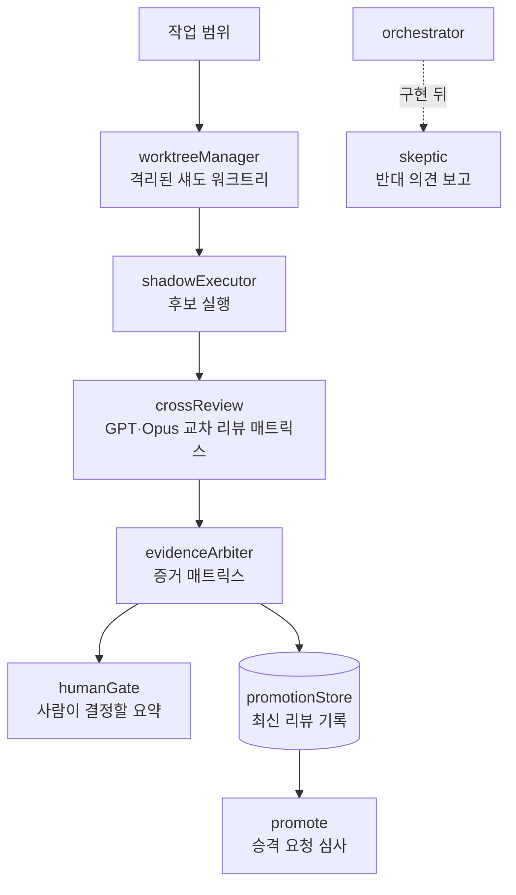

<p align="center">
  
</p>

**[English](README.md) | [한국어](README.ko.md)**

**터미널 코딩 에이전트 하나로 여러 모델 프로바이더를 쓰는 CLI다. Anthropic의 Claude Code에서 파생했고, 역할을 나눈 에이전트 모듈과 통과 기록 없는 `validated` 표기를 거부하는 목표 검증이 붙어 있다.**

- **프로바이더 라우팅 7종** — Anthropic OAuth · Codex OAuth · OpenAI 호환 `/v1` · Gemini · GitHub Models · Ollama · AWS Bedrock — [아래 표](#프로바이더-선택)
- **에이전트 역할 8종** — 오케스트레이터, 스켑틱, 구현자, 교차 리뷰, 증거 중재자(evidence arbiter), 섀도 실행·리뷰, 휴먼 게이트, 승격 — [`src/services/orchestra/`](src/services/orchestra), 모듈마다 단위 테스트가 있다
- **점검 명령 8종** — `bun test`부터 `verify:privacy`, `goals:validate`까지 전부 [`package.json`](package.json)에 정의돼 있다
- **목표 검증** — [`scripts/validate-goals.ts`](scripts/validate-goals.ts)가 필수 명령의 통과 기록 없이 `validated`/`closed`로 표기된 목표 파일을 거부한다
- **PR마다 CI** — 빌드와 단위 테스트, 배지는 아래에 있다

<p align="center">
  <a href="https://github.com/svy04/metaforge/actions/workflows/pr-checks.yml"></a>
</p>

<p align="center">
  <a href="#빌드">빌드</a> · <a href="#출처와-라이선스">라이선스</a> · <a href="#프로바이더-선택">프로바이더</a> · <a href="#역할이-이어지는-방식">역할 구조</a> · <a href="#점검-실행">점검</a> · <a href="#헤드리스-실행">헤드리스</a> · <a href="#나머지-구성">나머지</a> · <a href="#제보와-기여">기여</a>
</p>

## 빌드

```bash
bun install
bun run build        # CLI를 dist/cli.mjs로 번들
node dist/cli.mjs
```

CLI 안에서 `/provider`로 프로바이더를 설정하고 `/onboard-github`로 GitHub Models를 연결한다 — 둘 다 [`src/commands/`](src/commands)에 있다.

설치 가이드: [Windows](docs/quick-start-windows.md) · [macOS/Linux](docs/quick-start-mac-linux.md) · [비개발자용](docs/non-technical-setup.md) · [고급 설정](docs/advanced-setup.md) · [Android](ANDROID_INSTALL.md) · [LiteLLM](docs/litellm-setup.md)

npm 레지스트리에 `@gitlawb/openclaude` 패키지가 있지만 게시본이 이 체크아웃과 다르다 — 여기 있는 걸 쓰려면 소스에서 빌드해야 한다.

## 출처와 라이선스

런타임 코드는 Anthropic의 Claude Code CLI에서 파생했고, 원본 소스는 Anthropic PBC의 독점 소프트웨어다. 기여자 수정분은 법이 허용하는 범위에서 MIT로 제공된다 — 파생 런타임 전체에 대한 포괄 MIT가 아니다.

이 프로젝트는 Anthropic과 제휴·보증·후원 관계가 없고, Anthropic의 독점 소스를 배포할 권한도 없다. "Claude"와 "Claude Code"는 Anthropic PBC의 상표다.

코드를 재사용하거나 재배포하기 전에 [LICENSE](LICENSE)부터 읽어야 한다.

## 프로바이더 선택

| 프로바이더 | 라우팅 코드 |
| --- | --- |
| Anthropic Claude (OAuth) | `src/services/api/claude.ts` |
| Codex (ChatGPT OAuth) | `src/services/api/codexOAuth.ts` |
| OpenAI 호환 `/v1` 엔드포인트 | `src/services/api/openaiShim.ts` |
| Gemini | `src/utils/geminiAuth.ts` |
| GitHub Models | `src/utils/githubModelsCredentials.ts` |
| Ollama (로컬) | `src/utils/model/ollamaModels.ts` |
| AWS Bedrock | `src/utils/model/bedrock.ts` |

Vertex·Foundry SDK는 [`package.json`](package.json)에 선언돼 있다. 동작은 프로바이더와 모델에 따라 다르다 — 작은 로컬 모델은 긴 다단계 도구 호출을 잘 처리하지 못할 수 있다.

## 역할이 이어지는 방식

여덟 역할은 [`src/services/orchestra/`](src/services/orchestra) 아래 각각 별도 모듈이고, 대부분은 [`shadowReview.ts`](src/services/orchestra/shadowReview.ts)가 하나의 리뷰 파이프라인으로 잇는다. 오케스트레이터와 스켑틱은 본 질의 경로에 있다 — 스켑틱은 구현이 끝난 뒤 반대 의견을 낸다.



모듈 상자는 각각 같은 이름의 소스 파일에 대응하고, 저마다 단위 테스트가 있다. 구현자 라우팅(Codex)은 [`src/query/deps.ts`](src/query/deps.ts)에 연결돼 있다.

## 점검 실행

```bash
bun test                 # 단위 테스트 (Bun 테스트 러너)
bun run test:coverage    # 커버리지 리포트를 coverage/에 생성
bun run typecheck        # tsc --noEmit
bun run smoke            # 빌드 + 버전 확인
bun run doctor:runtime   # 로컬 환경 점검
bun run verify:privacy   # 외부 전송 없음·시크릿 스캔·공개 저장소 점검
bun run goals:validate   # 목표 스키마·트레이스 검증
bun run product:quality  # docs/product-quality/ 리포트 재생성
```

[`docs/product-quality/`](docs/product-quality)의 리포트는 이 스크립트들이 로컬에서 만든 자체 기록이다 — 외부 감사가 아니다. 조각들이 어떻게 이어지는지는 [아키텍처 맵](docs/product-quality/metaforge-architecture-map.md)과 [증거 목록](docs/product-quality/product-evidence-manifest.md)에 그려져 있다.

## 헤드리스 실행

`npm run dev:grpc`가 엔진을 `localhost:50051`의 gRPC 서비스로 띄우고(`GRPC_PORT`/`GRPC_HOST`로 변경), `npm run dev:grpc:cli`가 거기 붙는 터미널 클라이언트다. 정의는 [`src/proto/openclaude.proto`](src/proto/openclaude.proto)에 있다 — 로컬 개발용 경로고, 호스팅된 배포는 없다.

## 나머지 구성

- [`packages/openclaude-vscode/`](packages/openclaude-vscode) — OpenClaude 실행용 VS Code 확장 소스. 마켓플레이스 게시는 없다
- [`python/`](python) — 독립 Python 헬퍼(Ollama 프로바이더, Atomic Chat 프로바이더, 스마트 라우터)와 자체 테스트
- [`docs/goals/`](docs/goals) — [CG-001](docs/goals/CG-001-goal-kernel-mvp.md), [CG-002](docs/goals/CG-002-static-analysis-ratchet.md) 같은 목표 파일. [docs/GOAL_SCHEMA.md](docs/GOAL_SCHEMA.md) 스키마를 따르고, [`scripts/validate-goal-traces.ts`](scripts/validate-goal-traces.ts)가 [`docs/goals/traces/`](docs/goals/traces)의 기록을 검사한다
- [`docs/MIMESIS_ENGINEERING.md`](docs/MIMESIS_ENGINEERING.md) — 문서로 적어 둔 작업 방법: 잘 만든 기존 구현을 공부하고, 구조를 로컬에 맞게 옮기고, 검증한다. 출처 목록은 [`docs/research/`](docs/research)에 있다
- [`avf/`](avf) — 콘텐츠 제작 워크플로용 스키마·템플릿·런북과 샘플 배치. CLI가 기본으로 임포트하지는 않는다

## 제보와 기여

보안 제보는 [SECURITY.md](SECURITY.md)에, 지원 문의는 [SUPPORT.md](SUPPORT.md)에, 기여 방법은 [CONTRIBUTING.md](CONTRIBUTING.md)에 정리돼 있다. PR 전에 `bun run build`, `bun run smoke`, 바꾼 부분의 `bun test`를 돌린다.

프로젝트 공간에서는 [CODE_OF_CONDUCT.md](CODE_OF_CONDUCT.md)를 따른다. 라이선스는 [LICENSE](LICENSE)에 있다.
