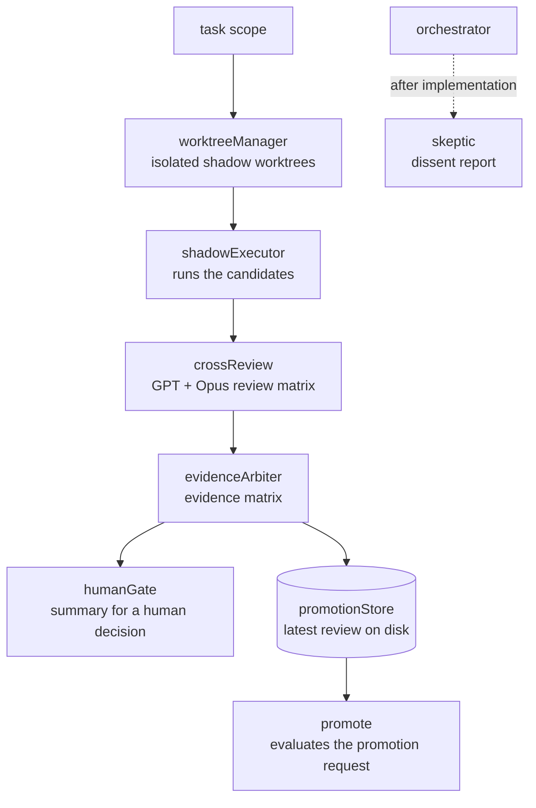

<p align="center">
  
</p>

**[English](README.md) | [한국어](README.ko.md)**

**One terminal coding agent, many model providers — a CLI derived from Anthropic's Claude Code, with role-split agent modules and goal validation that rejects a `validated` mark lacking a recorded passing result.**

- **7 provider routes** — Anthropic OAuth, Codex OAuth, OpenAI-compatible `/v1`, Gemini, GitHub Models, Ollama, AWS Bedrock — [table below](#pick-a-provider)
- **8 agent roles** — orchestrator, skeptic, implementer, cross-review, evidence arbiter, shadow execution and review, human gate, promotion — [`src/services/orchestra/`](src/services/orchestra), unit tests per module
- **8 check commands** — from `bun test` to `verify:privacy` and `goals:validate`, all defined in [`package.json`](package.json)
- **Goal validation** — [`scripts/validate-goals.ts`](scripts/validate-goals.ts) rejects any goal marked `validated` or `closed` whose required commands have no recorded passing result
- **CI on every PR** — build plus unit suites, badge below

<p align="center">
  <a href="https://github.com/svy04/metaforge/actions/workflows/pr-checks.yml"></a>
  <a href="https://github.com/svy04/metaforge/blob/main/LICENSE"></a>
  <a href="https://github.com/svy04/metaforge/stargazers"></a>
  <a href="#pick-a-provider"></a>
</p>

<p align="center">
  <a href="#build-it">Build</a> · <a href="#origin-and-license">License</a> · <a href="#pick-a-provider">Providers</a> · <a href="#how-the-roles-connect">Roles</a> · <a href="#run-the-checks">Checks</a> · <a href="#serve-it-headless">Headless</a> · <a href="#browse-the-rest">More</a> · <a href="#report-and-contribute">Contribute</a>
</p>

## Build it

```bash
bun install
bun run build        # bundles the CLI to dist/cli.mjs
node dist/cli.mjs
```

Inside the CLI, `/provider` opens provider setup and `/onboard-github` connects GitHub Models — both live under [`src/commands/`](src/commands).

Setup guides: [Windows](docs/quick-start-windows.md) · [macOS/Linux](docs/quick-start-mac-linux.md) · [non-technical](docs/non-technical-setup.md) · [advanced](docs/advanced-setup.md) · [Android](ANDROID_INSTALL.md) · [LiteLLM](docs/litellm-setup.md)

An npm package named `@gitlawb/openclaude` exists on the registry, but its published version does not match this checkout — build from source to get what is here.

## Origin and license

The runtime code is derived from Anthropic's Claude Code CLI; the original source is proprietary to Anthropic PBC. Contributor modifications are offered under MIT where legally permissible — this is not a blanket MIT license over the whole runtime.

The project is not affiliated with, endorsed by, or sponsored by Anthropic, and has no authorization to distribute Anthropic's proprietary source. "Claude" and "Claude Code" are trademarks of Anthropic PBC.

Read [NOTICE](NOTICE) before reusing or redistributing anything here. LICENSE carries the MIT text covering the modifications; NOTICE states what it does not cover.

## Pick a provider

| Provider | Route |
| --- | --- |
| Anthropic Claude (OAuth) | `src/services/api/claude.ts` |
| Codex (ChatGPT OAuth) | `src/services/api/codexOAuth.ts` |
| OpenAI-compatible `/v1` endpoints | `src/services/api/openaiShim.ts` |
| Gemini | `src/utils/geminiAuth.ts` |
| GitHub Models | `src/utils/githubModelsCredentials.ts` |
| Ollama (local) | `src/utils/model/ollamaModels.ts` |
| AWS Bedrock | `src/utils/model/bedrock.ts` |

Vertex and Foundry SDKs are declared in [`package.json`](package.json). Behavior differs by provider and model — small local models can struggle with long multi-step tool chains.

## How the roles connect

The eight roles are separate modules under [`src/services/orchestra/`](src/services/orchestra); [`shadowReview.ts`](src/services/orchestra/shadowReview.ts) wires most of them into one review pipeline. The orchestrator and skeptic sit on the main query path — the skeptic files its dissent after implementation.



Every module box maps to a source file of the same name, each with its own unit tests. The implementer route (Codex) is wired in [`src/query/deps.ts`](src/query/deps.ts).

## Run the checks

```bash
bun test                 # unit tests (Bun test runner)
bun run test:coverage    # coverage report into coverage/
bun run typecheck        # tsc --noEmit
bun run smoke            # build + version probe
bun run doctor:runtime   # local environment check
bun run verify:privacy   # no-phone-home, secret-scan, public-repo checks
bun run goals:validate   # goal schema and trace validation
bun run product:quality  # regenerates the docs/product-quality/ reports
```

The reports under [`docs/product-quality/`](docs/product-quality) are generated by these scripts on a local machine — the repository's own bookkeeping, not an external audit. How the pieces map together is drawn in the [architecture map](docs/product-quality/metaforge-architecture-map.md) and the [evidence manifest](docs/product-quality/product-evidence-manifest.md).

## Serve it headless

`npm run dev:grpc` starts the engine as a gRPC service on `localhost:50051` (`GRPC_PORT`/`GRPC_HOST` change it); `npm run dev:grpc:cli` runs a terminal client against it. Definitions live in [`src/proto/openclaude.proto`](src/proto/openclaude.proto) — a local development path, with no hosted deployment.

## Browse the rest

- [`packages/openclaude-vscode/`](packages/openclaude-vscode) — VS Code extension source for launching OpenClaude; no marketplace listing
- [`python/`](python) — standalone Python helpers (Ollama provider, Atomic Chat provider, smart router) with their own tests
- [`docs/goals/`](docs/goals) — goal files like [CG-001](docs/goals/CG-001-goal-kernel-mvp.md) and [CG-002](docs/goals/CG-002-static-analysis-ratchet.md), written against [docs/GOAL_SCHEMA.md](docs/GOAL_SCHEMA.md); [`scripts/validate-goal-traces.ts`](scripts/validate-goal-traces.ts) checks the traces under [`docs/goals/traces/`](docs/goals/traces)
- [`docs/MIMESIS_ENGINEERING.md`](docs/MIMESIS_ENGINEERING.md) — a written working method: study strong implementations, adapt their structure locally, verify the result; source lists in [`docs/research/`](docs/research)
- [`avf/`](avf) — schemas, templates, runbooks, and a sample batch for a content-production workflow; the CLI does not import these by default

## Report and contribute

Security reports go to [SECURITY.md](SECURITY.md), support routing to [SUPPORT.md](SUPPORT.md), contributions to [CONTRIBUTING.md](CONTRIBUTING.md) — before a PR, run `bun run build`, `bun run smoke`, and focused `bun test` on what you changed. [CODE_OF_CONDUCT.md](CODE_OF_CONDUCT.md) applies in project spaces.

License: see [LICENSE](LICENSE).
