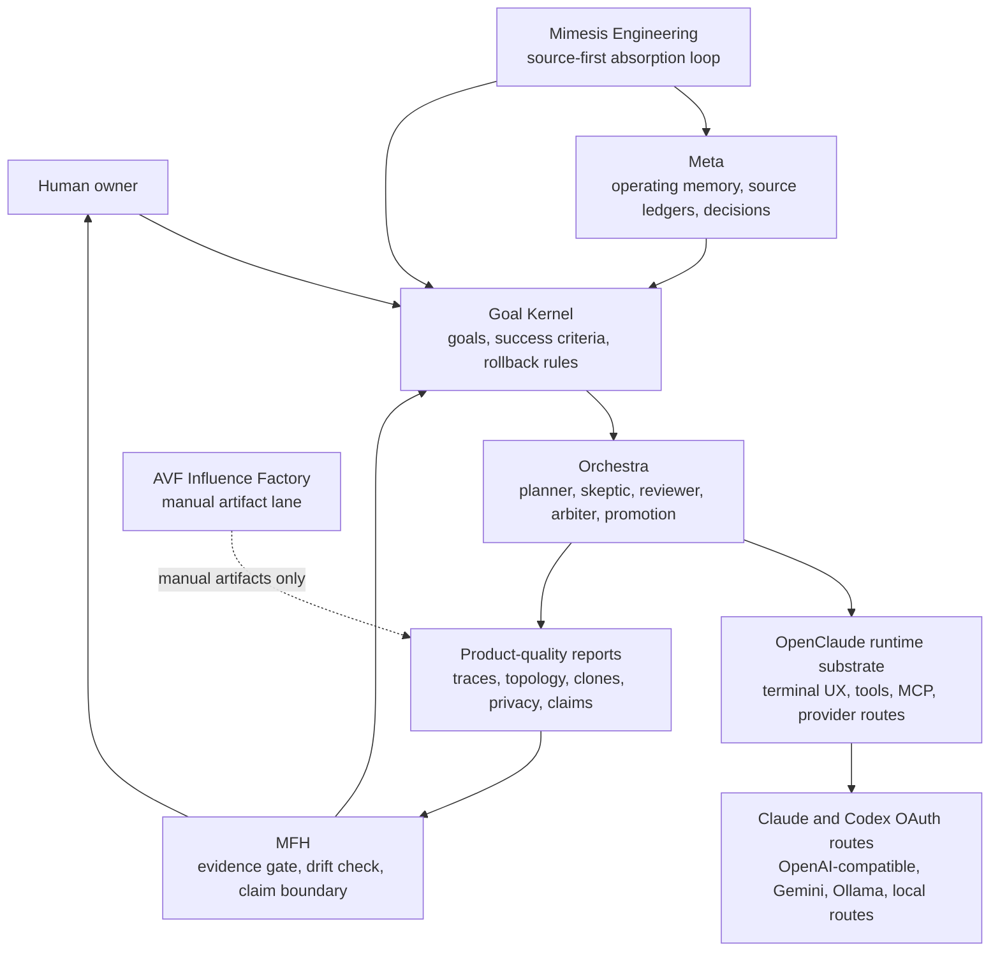
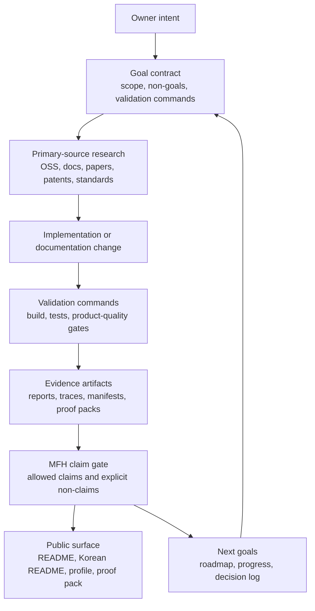
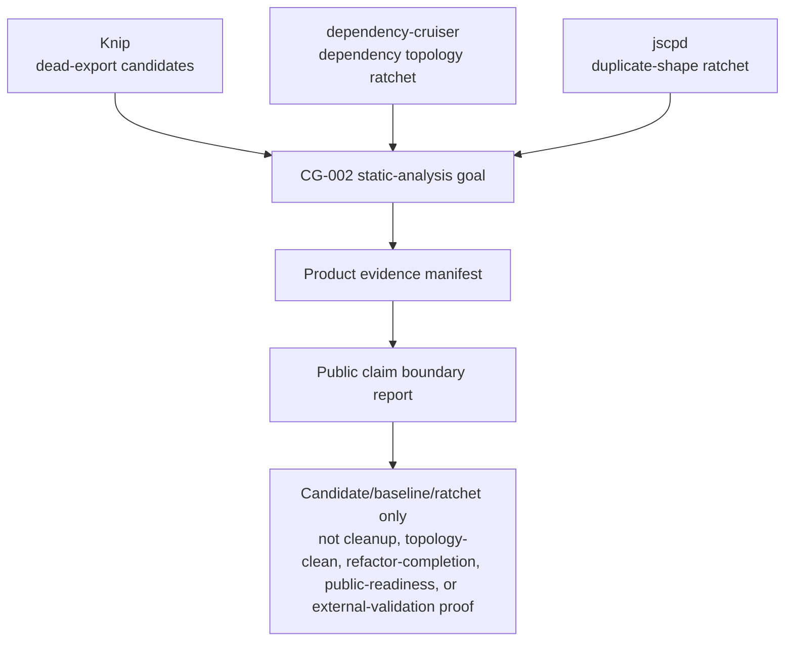

# Metaforge Architecture Map

Generated-by-hand from checked-in local evidence, not from live provider calls.

## Claim Boundary

- This is a public architecture visualization for Metaforge = Meta + MFH + Orchestra OS over the OpenClaude runtime substrate.
- It is derived from current docs, tests, and product-quality reports.
- It is not clean-architecture proof, not production readiness, not external validation, not topology cleanup, and not refactor completion.

## Source Evidence

| Evidence | Current role |
| --- | --- |
| `README.md` and `README.ko.md` | Public thesis, runtime substrate wording, origin/license boundary |
| `docs/PROJECT_SPEC.md` | North Star, operating loop, goal hierarchy |
| `docs/MFH_META_SYNTHESIS.md` | Meta/MFH import boundary and unresolved alias guard |
| `docs/AGENT_REGISTRY.md` | Agent role and Orchestra routing surface |
| `docs/RESEARCH_PIPELINE.md` | Source-first Mimesis loop |
| `docs/EVALS.md` | Eval and trace-grading boundary |
| `docs/SECURITY_AND_GUARDRAILS.md` | Permission, protected action, and safety controls |
| `docs/product-quality/public-claim-boundary-report.md` | Public claim evidence map and non-claims |
| `docs/product-quality/dependency-topology-report.md` | dependency-cruiser topology baseline and known-violation ratchet |
| `docs/product-quality/script-duplication-audit-report.md` | jscpd duplicate-shape ratchet |
| `docs/product-quality/dead-export-candidates-report.md` | Knip dead-export candidate inventory |
| `src/services/orchestra/` | runtime-wired import path for Orchestra surfaces |

## Operating Stack

## Evidence Closure Loop

## Static Analysis Trust Stack

Current static-analysis counters from checked-in product-quality reports:

### Knip dead-export candidate lane

Source: `docs/product-quality/dead-export-candidates-report.md`

- candidate_file_count: `637`
- candidate_unused_export_count: `1396`
- candidate_unused_type_count: `364`
- candidate_duplicate_export_count: `12`
- triage_record_count: `4`
- deletion_claim_allowed: `false`
- cleanup_completion_claim_allowed: `false`
- public_readiness_claim_allowed: `false`

### dependency-cruiser topology lane

Source: `docs/product-quality/dependency-topology-report.md`

- module_count: `2630`
- dependency_edge_count: `11984`
- circular_dependency_baseline: `1737`
- unresolved_dependency_baseline: `863`
- configured_dependency_cruiser_new_violation_count: `0`

### jscpd duplicate-shape lane

Source: `docs/product-quality/script-duplication-audit-report.md`

- jscpd_clone_count: `17`
- jscpd_duplicated_lines: `439`
- jscpd_duplicated_tokens: `2979`
- jscpd_duplicated_percentage: `1.043871121150874`
- public_readiness_claim_allowed: `false`
- refactor_completion_claim_allowed: `false`

Those counters are ratchet evidence. They are not clean-architecture proof and they do not prove public readiness.

## Primary Source Method

- Mermaid flowcharts are used because Mermaid supports text-defined flowcharts in Markdown-friendly syntax: https://mermaid.js.org/syntax/flowchart.html
- dependency-cruiser is already the local topology source and supports graph-oriented dependency reporting: https://github.com/sverweij/dependency-cruiser
- jscpd is already the local duplicate-shape source: https://github.com/kucherenko/jscpd
- The C4 model's useful constraint here is map-like communication at different abstraction levels, not a claim that this repo has a complete C4 model: https://c4model.com/introduction

## Reading Rule

Treat this page as a navigation map. The evidence lives in the linked reports, tests, scripts, and docs. If this map conflicts with a current generated report, the generated report wins until this map is updated.
